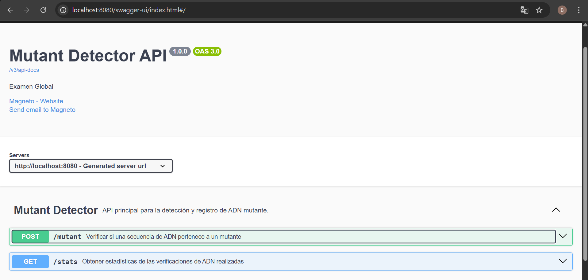
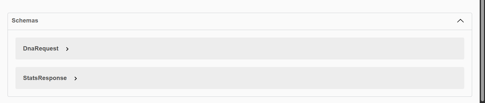
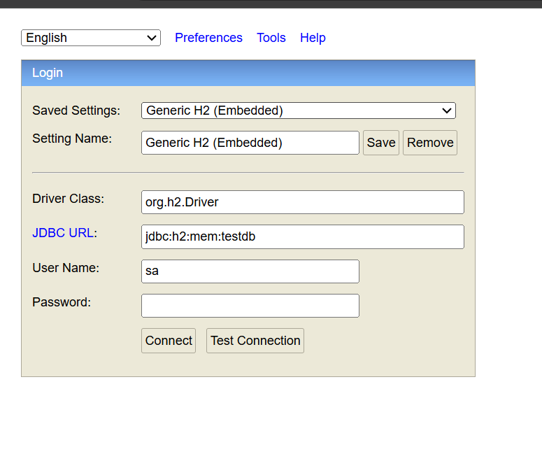
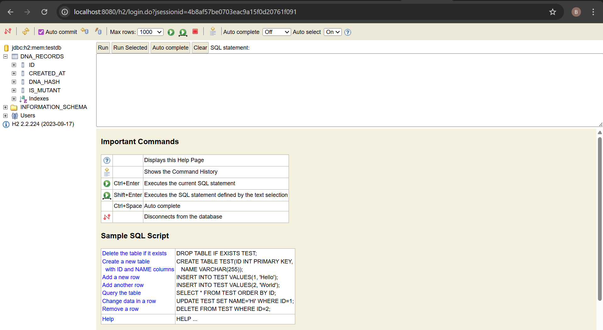
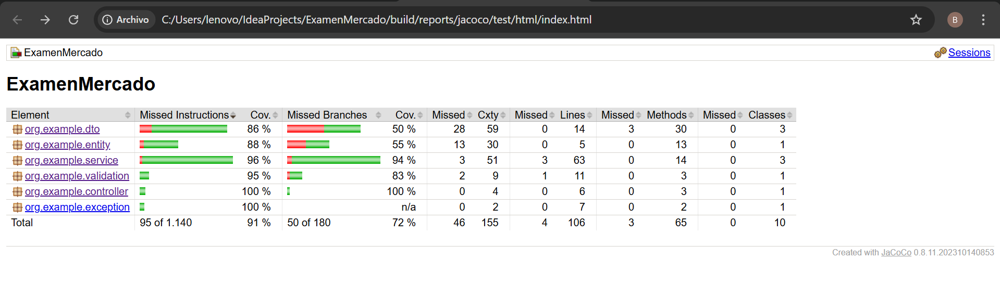
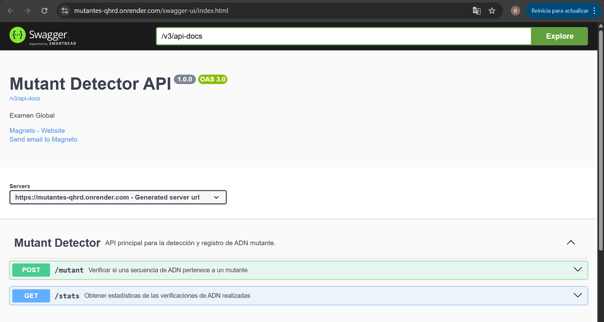

# 🧬 Mutant Detector API — Examen Global- UTN/FRM

API REST que determina si una secuencia de ADN pertenece a un mutante, mediante la detección de patrones de 4 letras iguales en múltiples direcciones.
Incluye validaciones avanzadas, persistencia con hash único, caché, Swagger y tests automatizados.


---------------------------------------------------------------
## **‍💻 Autor**

Brenda Alcoba

---------------------------------------------------------------

Repositorio: https://github.com/BrendaAlcoba/Mutantes_2

## **📚 Tabla de Contenidos**

1. Descripción del Problema
2. Arquitectura General
3. Algoritmo de Detección
4. Persistencia y Caché
5. Endpoints
6. Instalación y Ejecución
7. Testing y cobertura
8. Diagramas de Secuencia
9. Tecnologías Usadas

## **1. 🧾 Descripción del Problema**

Dado un arreglo de N cadenas de longitud N, que representan un ADN, el sistema debe detectar si contiene dos o más secuencias de cuatro letras iguales consecutivas:

Direcciones válidas:

* Horizontal →
* Vertical ↓
* Diagonal descendente ↘
* Diagonal ascendente ↗

Regla:


✔ 2 o más secuencias → Mutante (200 OK)

✘ 0 o 1 secuencia → No mutante (403 Forbidden)

## **2. 🏗 Arquitectura General**

El proyecto implementa una arquitectura en capas, con responsabilidades bien separadas:

``` 
Mutantes/
│
├── 📂 src/main/java/org/example/
│   │
│   ├── 📂 config/                    ← Configuraciones
│   │   └── SwaggerConfig.java        (OpenAPI/Swagger)
│   │
│   ├── 📂 controller/                ← Capa de presentación
│   │   └── MutantController.java     (Endpoints REST)
│   │
│   ├── 📂 dto/                       ← Objetos de transferencia
│   │   ├── DnaRequest.java           (Input API)
│   │   ├── StatsResponse.java        (Output API)
│   │   └── ErrorResponse.java        (Errores)
│   │
│   ├── 📂 entity/                    ← Entidades JPA
│   │   └── DnaRecord.java            (Tabla dna_records)
│   │
│   ├── 📂 exception/                 ← Manejo de errores
│   │   ├── GlobalExceptionHandler.java
│   │   └── DnaHashCalculationException.java
│   │
│   ├── 📂 repository/                ← Acceso a datos
│   │   └── DnaRecordRepository.java  (Interface JPA)
│   │
│   ├── 📂 service/                   ← Lógica de negocio
│   │   ├── MutantDetector.java       (Algoritmo core)
│   │   ├── MutantService.java        (Orquestación)
│   │   └── StatsService.java         (Estadísticas)
│   │
│   ├── 📂 validation/                ← Validaciones custom
│   │   ├── ValidDnaSequence.java     (Anotación)
│   │   └── ValidDnaSequenceValidator.java (Lógica)
│   │
│   └── MutantDetectorApplication.java ← Main class
│
├── 📂 src/main/resources/
│   └── application.properties        ← Configuración app
│
├── 📂 src/test/java/org/example/    ← Tests
│   ├── 📂 controller/
│   │   └── MutantControllerTest.java
│   └── 📂 service/
│       ├── MutantDetectorTest.java
│       ├── MutantServiceTest.java
│       └── StatsServiceTest.java
│
├── 📂 build/                         ← Archivos compilados
├── 📂 gradle/                        ← Wrapper de Gradle
│
├── build.gradle                      ← Dependencias
├── settings.gradle                   ← Config Gradle
├── gradlew / gradlew.bat            ← Scripts Gradle
├── CLAUDE.md                         ← Guía técnica
└── README.md                         ← Este archivo
``` 
### Diagrama de Capas

```
┌─────────────────────────────────────────────────────────────┐
│                    CLIENTE (Postman/Navegador)              │
└──────────────────────────┬──────────────────────────────────┘
                           │ HTTP Request (JSON)
                           ↓
┌────────────────────────────────────────────────────────────┐
│  CAPA 1: CONTROLLER                                        │
│  📁 controller/MutantController.java                       │
│                                                            │
│  ✅ Recibe requests HTTP (POST /mutant, GET /stats)        │
│  ✅ Valida datos de entrada (@Validated)                   │
│  ✅ Retorna respuestas HTTP (200, 403, 400)                │
│  ✅ Documentado con Swagger (@Operation, @ApiResponse)     │
└──────────────────────────┬──────────────────────────────────┘
                           │ DnaRequest
                           ↓
┌─────────────────────────────────────────────────────────────┐
│  CAPA 2: DTO (Data Transfer Objects)                        │
│  📁 dto/DnaRequest.java                                     │
│  📁 dto/StatsResponse.java                                  │
│                                                             │
│  ✅ Define contratos de API (Request/Response)              │
│  ✅ Validaciones personalizadas (@ValidDnaSequence)         │
│  ✅ Conversión JSON ↔ Java (Jackson)                        │
└──────────────────────────┬──────────────────────────────────┘
                           │ String[] dna
                           ↓
┌─────────────────────────────────────────────────────────────┐
│  CAPA 3: SERVICE (Lógica de Negocio)                        │
│  📁 service/MutantService.java                              │
│  📁 service/MutantDetector.java                             │
│  📁 service/StatsService.java                               │
│                                                             │
│  ✅ Lógica de negocio principal                             │
│  ✅ Algoritmo de detección de mutantes                      │
│  ✅ Cálculo de hash SHA-256                                 │
│  ✅ Orquestación entre capas                                │
└──────────────────────────┬──────────────────────────────────┘
                           │ DnaRecord (entidad)
                           ↓
┌────────────────────────────────────────────────────────────┐
│  CAPA 4: REPOSITORY (Acceso a Datos)                       │
│  📁 repository/DnaRecordRepository.java                    │
│                                                            │
│  ✅ Interfaz JPA (Spring Data)                             │
│  ✅ Métodos de consulta automáticos                        │
│  ✅ findByDnaHash(), countByIsMutant()                     │
└──────────────────────────┬─────────────────────────────────┘
                           │ SQL Queries
                           ↓
┌─────────────────────────────────────────────────────────────┐
│  CAPA 5: ENTITY (Modelo de Datos)                           │
│  📁 entity/DnaRecord.java                                   │
│                                                             │
│  ✅ Mapeo Objeto-Relacional (ORM)                           │
│  ✅ Anotaciones JPA (@Entity, @Table, @Column)              │
│  ✅ Definición de índices                                   │
└──────────────────────────┬──────────────────────────────────┘
                           │ JDBC
                           ↓
┌─────────────────────────────────────────────────────────────┐
│  CAPA 6: BASE DE DATOS                                      │
│  💾 H2 Database (en memoria)                                │
│                                                             │
│  Tabla: dna_records                                         │
│  ├── id (PK, auto-increment)                                │
│  ├── dna_hash (unique, indexed)                             │
│  ├── is_mutant (boolean, indexed)                           │
│  └── created_at (timestamp)                                 │
└─────────────────────────────────────────────────────────────┘

┌─────────────────────────────────────────────────────────────┐
│  CAPAS TRANSVERSALES                                        │
│  📁 exception/GlobalExceptionHandler.java                   │
│  📁 validation/ValidDnaSequenceValidator.java               │
│  📁 config/SwaggerConfig.java                               │
│                                                             │
│  ✅ Manejo de errores global                                │
│  ✅ Validaciones custom                                     │
│  ✅ Configuración de Swagger                                │
└─────────────────────────────────────────────────────────────┘
```


## **3. 🧠 Algoritmo de Detección**

Implementado en MutantDetector, optimizado mediante:

✔ Conversión previa a char[][] para acceso O(1)

✔ Recorrido de matriz una sola vez

✔ Early Termination: si hay 2 secuencias → corta

✔ Manejo de límites para evitar IndexOutOfBounds

✔ Detección en 4 direcciones

✔ Detección de solapamientos (AAAAA = 2 secuencias)


## **4. 💾 Persistencia y Caché**

Implementada en MutantService.

Flujo:

Se calcula un hash SHA-256 del ADN.

Se busca en la tabla dna_records usando un índice único.

Si ya existe → se devuelve el resultado guardado (cache hit).

Si no existe → se analiza, se persiste y se retorna el resultado.


## **5. 🌐 Endpoints**

🔹 POST /mutant

Request

{
"dna": ["ATGCGA","CAGTGC","TTATGT","AGAAGG","CCCCTA","TCACTG"]
}


_Respuestas_

Código	                Significado
200 OK               	Es mutante
403 Forbidden	        No mutante
400 Bad Request	        Error de validación


🔹 GET /stats

Response

{
"countMutantDna": 40,
"countHumanDna": 100,
"ratio": 0.4
}

## **6. 🛠 Instalación y Ejecución**
1. Clonar repositorio
   git clone https://github.com/BrendaAlcoba/Mutantes_2.git
   cd Mutantes

2. Ejecutar
   ./gradlew bootRun

3. Acceder

Swagger:
http://localhost:8080/swagger-ui.html





H2:
http://localhost:8080/h2





## **7. 🧪 Testing y Cobertura**

El proyecto incluye:

✔ Tests unitarios del algoritmo

✔ Tests del Service (con mocks)

✔ Tests del Controller (WebMvcTest)

✔ Tests del StatsService

✔ Validaciones e inputs inválidos

✔ Casos límite (bordes, NxN, solapamientos)


📊 Cobertura total: ~91%




Los reportes se generan en:

/build/reports/tests/jacoco/test/html/

Comando:

./gradlew test


./gradlew test jacocoTestReport


## **8. 📊 Diagramas de Secuencia**

🔹 **POST /mutant**

Incluye validación → caché → algoritmo → persistencia.

```
sequenceDiagram
participant Cliente as Cliente (JSON)
participant Controller as MutantController
participant Service as MutantService
participant Detector as MutantDetector
participant Repository as DnaRecordRepository
participant DB as H2 Database

    Cliente->>Controller: (1) POST /mutant (DnaRequest)
    activate Controller

    Controller->>Controller: (2) Validación @Valid
    Controller->>Service: (3) process(dna[])

    activate Service
    Note right of Service: (3.1) Calcular Hash SHA-256

    Service->>Repository: (4) findByDnaHash(hash)
    activate Repository
    Repository->>DB: SELECT * FROM dna_records WHERE dna_hash = hash
    DB-->>Repository: Resultado (hit/miss)
    deactivate Repository

    alt Cache Hit
        Repository-->>Service: DnaRecord con isMutant
        Note right of Service: Devuelve resultado cacheado\n(no re-ejecuta el algoritmo)
    else Cache Miss
        Service->>Detector: (5) isMutant(dna[])
        activate Detector

        Note right of Detector: Recorre matriz NxN\n4 direcciones\nEarly Termination
        Detector-->>Service: Resultado boolean
        deactivate Detector

        Service->>Repository: (6) save(new DnaRecord)
        activate Repository
        Repository->>DB: INSERT INTO dna_records (...)
        DB-->>Repository: OK
        deactivate Repository
    end

    Service-->>Controller: (7) isMutant = true/false
    deactivate Service

    Controller->>Controller: (8) Determina HTTP status
    alt Mutante
        Controller-->>Cliente: 200 OK
    else Humano
        Controller-->>Cliente: 403 Forbidden
    end
    deactivate Controller
```

🔹 **GET /stats**

Consulta directa al repositorio.
```
sequenceDiagram
participant Cliente as Cliente (GET)
participant Controller as MutantController
participant Service as StatsService
participant Repository as DnaRecordRepository
participant DB as H2 Database

    Cliente->>Controller: GET /stats
    activate Controller
    Controller->>Service: getStats()
    activate Service

    Note right of Service: 1. Contar Mutantes (O(1))
    Service->>Repository: countByIsMutant(true)
    activate Repository
    Repository->>DB: SELECT COUNT(*) WHERE is_mutant = true
    DB-->>Repository: countMutantes
    deactivate Repository
    
    Note right of Service: 2. Contar Humanos (O(1))
    Service->>Repository: countByIsMutant(false)
    activate Repository
    Repository->>DB: SELECT COUNT(*) WHERE is_mutant = false
    DB-->>Repository: countHumanos
    deactivate Repository

    Service->>Service: 3. Calcula Ratio
    Note right of Service: ratio = mutantes / humanos
    
    Service-->>Controller: StatsResponse
    deactivate Service

    Controller->>Cliente: 200 OK (StatsResponse)
    deactivate Controller
```

## **9. 🧰 Tecnologías Usadas**

* Java 17
* Spring Boot 3
* Spring Web
* Spring Validation
* Spring Data JPA
* H2 Database
* Lombok
* OpenAPI / Swagger
* JUnit 5
* Mockito
* Gradle


## **🚀 Deploy en Render (Docker)**

El proyecto fue desplegado utilizando Render mediante un Dockerfile multistage, lo que permite construir y ejecutar la aplicación de forma aislada y optimizada.


**🔗 URLs del Proyecto en Producción**

-----------------------------------------------------------------------------------------------------------
```
    Recurso	                                              URL

API Base	                              |      https://mutantes-qhrd.onrender.com
Swagger UI (Documentación)	              |      https://mutantes-qhrd.onrender.com/swagger-ui/index.html
POST /mutant	                          |      https://mutantes-qhrd.onrender.com/mutant
GET /stats	                              |      https://mutantes-qhrd.onrender.com/stats
```
------------------------------------------------------------------------------------------------------------




**🐳 Dockerfile utilizado**

El deploy se realizó con un Dockerfile multistage que:

* Compila la aplicación con Gradle en una imagen base de Java (etapa build)
* Copia solo el JAR final a una imagen ligera (etapa runtime)
* Reduce el tamaño y acelera el inicio del servicio
* Expone el puerto 8080 para que Render pueda servir la API
--------------------------------------------------------------------------------------------------------------
## **✅ Conclusión** 

Este proyecto permitió integrar conocimientos de arquitectura backend, pruebas automatizadas y despliegue en la nube. La API cumple con los requisitos funcionales solicitados y fue empaquetada mediante Docker y desplegada en Render utilizando un enfoque multistage. El resultado final es un servicio estable, documentado con Swagger y accesible públicamente, demostrando un flujo completo de desarrollo profesional.

